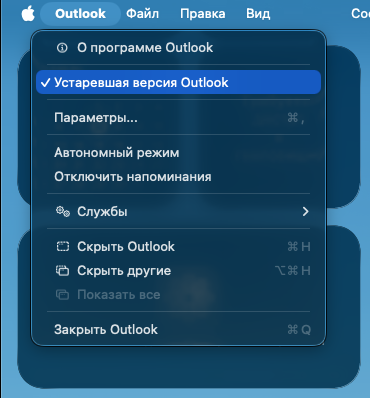

# Переустановка Microsoft Office для Mac начисто

Пошаговая инструкция для пользователей: как удалить Office, поставить заново и вернуть почту. Скрипты запускаются по очереди, по одной команде в Terminal.

[Выбор: сохранить профиль или начисто](#шаг-0-выберите-что-делать-с-профилем-outlook) · [Шаги](#шаги) · [Exchange on-premise](#exchange-on-premise-и-новый-outlook) · [Кратко](#кратко) · [English](#english)

## Шаг 0. Выберите, что делать с профилем Outlook

Профиль Outlook — это локальные данные почты на вашем Mac. Что с ним делать, нужно решить до запуска первого скрипта, потому что от этого зависят ответы на его вопросы.

| Вариант | Когда выбрать | Что произойдёт |
|---|---|---|
| **Сохранить профиль** (рекомендуется) | Есть локальные архивы («На моём компьютере»), почта POP, правила и подписи, которые не хочется настраивать заново, или вы не уверены | Скрипт сохранит копию данных Outlook на Рабочий стол, после установки второй скрипт вернёт её |
| **Удалить профиль полностью** | Почта IMAP, Exchange или Microsoft 365, и локальных архивов нет. Нужна полностью чистая установка | Профиль удаляется без копии. После установки Outlook заново скачает все письма с сервера |
| **Не трогать профиль** | Нужно только переустановить программы | Данные Outlook остаются на месте. В профиле могут остаться следы старой установки |

> **Внимание.** Если в Outlook есть локальные архивы или папки «На моём компьютере», при полном удалении профиля без копии они **будут потеряны безвозвратно**: на сервере их нет. Не уверены: выбирайте «Сохранить профиль».

Заранее подготовьте:

- пароль от учётной записи macOS (скрипт его запросит);
- данные для входа в рабочую учётную запись Microsoft 365 или лицензию, по которой активируется Office;
- логин и пароль от почты, если после восстановления Outlook попросит войти заново.

## Шаги

### 1. Удаление Office

Закройте все приложения Office (Cmd+Q) и выполните в Terminal:

```
sh -c "$(curl -fsSL https://raw.githubusercontent.com/f0nwa/OfficeUninstall/master/office_uninstaller.sh)"
```

Скрипт попросит пароль от учётной записи macOS и «Полный доступ к диску» для Terminal (откроет нужные настройки сам). Затем он покажет, что нашёл, и задаст вопросы. Отвечайте по выбору из шага 0:

| Вопрос скрипта | Сохранить профиль | Удалить полностью | Не трогать профиль |
|---|---|---|---|
| Удалить данные Office из пользовательского профиля? | **д** | **д** | **н** |
| Сохранить резервную копию данных Outlook на Рабочий стол? | **д** | **н** | не задаётся |
| Удалить Microsoft Office и все остальные компоненты? | **д** | **д** | **д** |
| Удалить Microsoft Defender? (задаётся, только если он найден) | **н**, если Defender нужен для защиты компьютера | то же | то же |
| Удалить из связки ключей записи аккаунта Microsoft / Office? | по желанию: если раньше были проблемы со входом или активацией, ответьте «д» и подтверждайте каждую запись отдельно | то же | то же |

Если выбрали сохранение, дождитесь строки о том, что копия сохранена в папку `OfficeUninstall-backup-ГГГГММДД-ЧЧММСС` на Рабочем столе. Если скрипт сообщил, что копия неполная, откажитесь от удаления данных Outlook и разберитесь с причиной (чаще всего нужен «Полный доступ к диску»).

### 2. Перезагрузка

**Перезагрузите Mac.** Это особенно важно перед повторной установкой Office.

### 3. Установка Office

Скачайте установщик и установите Office. Где взять актуальный установщик, написано в [README](../../README.md#где-скачать-office-и-как-активировать). **Не открывайте приложения Office сразу после установки**, если нужно отключить автообновление или активировать Office установщиком корпоративной лицензии.

### 4. Отключение автообновления (по необходимости)

Если автоматическое обновление Office не нужно (например, чтобы версия не менялась без вашего ведома), выполните:

```
sh -c "$(curl -fsSL https://raw.githubusercontent.com/f0nwa/OfficeUninstall/master/office_remove_mau.sh)"
```

Скрипт запросит пароль, покажет, что осталось от Microsoft AutoUpdate, и спросит подтверждение (по умолчанию «нет»). После этого пункт «Проверить обновления» в Office работать не будет, обновления придётся ставить вручную. Пропустите шаг, если автообновление устраивает.

### 5. Активация

- **Microsoft 365 (подписка).** Откройте любое приложение Office и войдите в рабочую или личную учётную запись.
- **Office LTSC по корпоративной лицензии.** Запустите VL Serializer, полученный администратором ([подробности](../../README.md#где-скачать-office-и-как-активировать)). Лицензия удаляется вместе с Office, поэтому после переустановки серализатор нужно запускать снова.

Затем **полностью закройте все приложения Office (Cmd+Q)**: восстановление профиля не запустится, пока они открыты.

### 6. Восстановление профиля

Только если на шаге 1 вы сохраняли копию. Выполните в Terminal (без `sudo`):

```
sh -c "$(curl -fsSL https://raw.githubusercontent.com/f0nwa/OfficeUninstall/master/office_restore.sh)"
```

Скрипт найдёт копию на Рабочем столе (если их несколько, предложит выбрать), при необходимости сам запустит и закроет Outlook, сохранит текущие данные в `OfficeUninstall-before-restore-*` и вернёт данные из копии. Не удаляйте папку с копией, пока не убедитесь, что вся почта и архивы на месте.

Если копию не делали, пропустите шаг: при первом запуске Outlook добавьте учётную запись, и письма загрузятся с сервера. Для Exchange on-premise сначала прочитайте [следующий раздел](#exchange-on-premise-и-новый-outlook).

### 7. Первый запуск Outlook

Откройте Outlook. После восстановления может понадобиться заново войти в учётную запись. Если используется Exchange on-premise, переключитесь на прежний интерфейс (см. ниже).

## Exchange on-premise и новый Outlook

Если почта размещена на собственном сервере организации (**Exchange on-premise**), не пользуйтесь новым интерфейсом Outlook. По опыту автора, который сопровождал десятки пользователей, в прежнем (классическом) интерфейсе Outlook работает заметно стабильнее.

После переустановки при **первом запуске** Outlook переключите интерфейс на прежний: в строке меню macOS (вверху экрана) откройте меню **Outlook** и выберите **«Устаревшая версия Outlook»**. Рядом с пунктом появится галочка, Outlook может перезапуститься.



Делайте это до добавления учётной записи или сразу после восстановления профиля. Если вы вернули профиль скриптом, переключитесь, как только Outlook откроется после восстановления.

Для Microsoft 365 и IMAP это не обязательно.

## Кратко

1. Решите, что делать с профилем: сохранить или удалить полностью. Локальные архивы без копии теряются.
2. `office_uninstaller.sh`: ответьте на вопросы по таблице выше.
3. Перезагрузите Mac.
4. Установите Office, пока не открывая приложения.
5. По необходимости: `office_remove_mau.sh`.
6. Активируйте Office, затем закройте все приложения (Cmd+Q).
7. Если делали копию: `office_restore.sh`.
8. Запустите Outlook. При Exchange on-premise переключитесь на прежний интерфейс.

---

# English

# Reinstalling Microsoft Office for Mac from scratch

A step-by-step guide for users: remove Office, install it again and get your mail back. The scripts are run one after another, one command per step in Terminal.

## Step 0. Decide what to do with the Outlook profile

The Outlook profile is the local mail data on your Mac. Decide before running the first script, because its questions depend on the choice.

| Option | When to choose | What happens |
|---|---|---|
| **Keep the profile** (recommended) | You have local archives ("On My Computer"), POP mail, rules and signatures you do not want to set up again, or you are not sure | The script saves a copy of the Outlook data to the Desktop, and after installation the second script puts it back |
| **Remove the profile completely** | IMAP, Exchange or Microsoft 365 mail and no local archives. You want a fully clean installation | The profile is removed without a copy. After installation Outlook downloads all messages from the server again |
| **Leave the profile alone** | You only need to reinstall the apps | Outlook data stays in place. Traces of the old installation may remain in the profile |

> **Warning.** If Outlook has local archives or "On My Computer" folders, removing the profile without a copy **loses them for good**: they are not on the server. If unsure, choose "Keep the profile".

Prepare in advance:

- your macOS account password (the script asks for it);
- the sign-in details of your Microsoft 365 account, or the license Office is activated with;
- your mail login and password in case Outlook asks you to sign in again after the restore.

## Steps

### 1. Remove Office

Quit all Office apps (Cmd+Q) and run in Terminal:

```
sh -c "$(curl -fsSL https://raw.githubusercontent.com/f0nwa/OfficeUninstall/master/office_uninstaller.sh)"
```

The script asks for the macOS account password and for "Full Disk Access" for Terminal (it opens the settings itself). Then it shows what it found and asks questions. Answer according to your choice from step 0:

| Script question | Keep the profile | Remove completely | Leave the profile |
|---|---|---|---|
| Remove the user profile data of Office? | **y** | **y** | **n** |
| Save a backup copy of Outlook data to the Desktop first? | **y** | **n** | not asked |
| Remove Microsoft Office and all other components? | **y** | **y** | **y** |
| Remove Microsoft Defender? (asked only if it is found) | **n** if Defender protects the computer | same | same |
| Delete Microsoft account / Office entries from the keychain? | optional: if you had sign-in or activation problems before, answer "y" and confirm each entry separately | same | same |

If you chose to keep the data, wait for the line saying the copy is stored in the `OfficeUninstall-backup-YYYYMMDD-HHMMSS` folder on the Desktop. If the script says the backup is incomplete, refuse to remove the Outlook data and find the reason (most often Full Disk Access is missing).

### 2. Restart

**Restart your Mac.** This matters most before reinstalling Office.

### 3. Install Office

Download the installer and install Office. Where to get a current installer is described in the [README](../../README.md#where-to-download-office-and-how-to-activate). **Do not open the Office apps right after installation** if you need to disable auto-update or to activate Office with the volume license installer.

### 4. Disable auto-update (if needed)

If you do not want Office to update itself (for example, to keep the version from changing without your knowledge), run:

```
sh -c "$(curl -fsSL https://raw.githubusercontent.com/f0nwa/OfficeUninstall/master/office_remove_mau.sh)"
```

The script asks for the password, shows what is left of Microsoft AutoUpdate and asks for confirmation (default "no"). Afterwards "Check for Updates" in Office no longer works, and updates have to be installed by hand. Skip this step if auto-update is fine.

### 5. Activate

- **Microsoft 365 (subscription).** Open any Office app and sign in with your work or personal account.
- **Office LTSC under a volume license.** Run the VL Serializer obtained by your administrator ([details](../../README.md#where-to-download-office-and-how-to-activate)). The license is removed together with Office, so run the serializer again after reinstalling.

Then **quit all Office apps completely (Cmd+Q)**: the profile restore does not start while they are open.

### 6. Restore the profile

Only if you saved a copy in step 1. Run in Terminal (without `sudo`):

```
sh -c "$(curl -fsSL https://raw.githubusercontent.com/f0nwa/OfficeUninstall/master/office_restore.sh)"
```

The script finds the copy on the Desktop (offers a choice if there are several), starts and closes Outlook itself if needed, saves the current data to `OfficeUninstall-before-restore-*` and restores the data from the copy. Do not delete the backup folder until you are sure all mail and archives are in place.

If you made no copy, skip this step: on the first launch add your account in Outlook and the messages download from the server. For on-premise Exchange read the [next section](#on-premise-exchange-and-new-outlook) first.

### 7. First Outlook launch

Open Outlook. After the restore you may need to sign in to the account again. With on-premise Exchange, switch to the previous interface (see below).

## On-premise Exchange and new Outlook

If your mail is hosted on your organization's own server (**on-premise Exchange**), do not use the new Outlook interface. In the author's experience supporting dozens of users, Outlook works noticeably more stably in the previous (classic) interface.

After reinstalling, on the **first launch** of Outlook switch the interface to the previous one: in the macOS menu bar (top of the screen) open the **Outlook** menu and choose **"Legacy Outlook"** (shown as "Устаревшая версия Outlook" in the Russian interface, see the screenshot). A check mark appears next to it, and Outlook may restart.


Do this before adding the account or right after the profile restore. If you restored the profile with the script, switch as soon as Outlook opens after the restore.

This is not required for Microsoft 365 and IMAP.

## In short

1. Decide what to do with the profile: keep it or remove it completely. Local archives are lost without a copy.
2. `office_uninstaller.sh`: answer the questions according to the table above.
3. Restart your Mac.
4. Install Office without opening the apps yet.
5. If needed: `office_remove_mau.sh`.
6. Activate Office, then quit all apps (Cmd+Q).
7. If you made a copy: `office_restore.sh`.
8. Launch Outlook. With on-premise Exchange switch to the previous interface.
